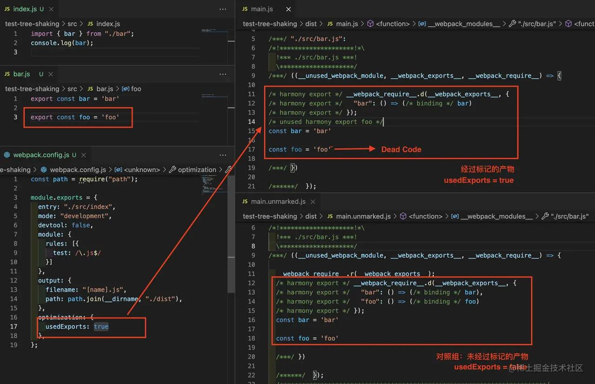

# 优化方案总结

## 构建时间优化

1. 开启热更新
2. 利用`exclude & include`这两个属性确定loader的解析范围, 可以大大提高构建速度.
3. babel开启缓存策略 `cacheDirectory: true;` 二次构建的时候只针对有改变的js文件.其他js文件使用首次构建的缓存内容
4. 构建区分环境:
    + 开发环境：去除代码压缩、gzip、体积分析等优化的配置，大大提高构建速度
    + 生产环境：需要代码压缩、gzip、体积分析等优化的配置，大大降低最终项目打包体积


## 打包体积优化

1. CSS代码压缩: 使用`css-minimizer-webpack-plugin`
2. JS代码压缩: 使用`terser-webpack-plugin`

```js
// webpack.prod.js

const TerserPlugin = require('terser-webpack-plugin')

  optimization: {
    minimizer: [
      new CssMinimizerPlugin(), // 去重压缩css
      new TerserPlugin({ // 压缩JS代码
        terserOptions: {
          compress: {
            drop_console: true, // 去除console
          },
        },
      }), // 压缩JavaScript
    ],
  }
```

3. tree-shaking: 当打包的mode为production时，自动开启tree-shaking进行优化. 只打包用到的代码，没用到的代码不打包

4. 打包体积分析: 使用webpack-bundle-analyzer可以审查打包后的体积分布，进而进行相应的体积优化(分包)
```js
const {
  BundleAnalyzerPlugin
} = require('webpack-bundle-analyzer')

  plugins: [
    new BundleAnalyzerPlugin(),
]
```

5. 利用webpack externals从输出的bundle中排除依赖. 设置了以后，import的包，不会被打包到最终的bundle中，运行时，再从外部去获取依赖；外部获取依赖可通过在index.html引入cdn来获取资源
```js
module.exports = {
  mode: 'development',
  externals: {
    jquery: 'jQuery'
  },
  plugins: [
    new HtmlWebpackExternalsPlugin({
      externals: [{
        module: 'jquery',
        entry: 'https://unpkg.com/jquery@3.2.1/dist/jquery.min.js',
        global: 'jQuery',
      }],
    })
  ]
};
```

6. dll使用动态链接库来提高打包速度: 就是事先把常用但又构建时间长的代码提前打包好（例如 react、react-dom），取个名字叫 dll。后面再打包的时候就跳过原来的未打包代码，直接用 dll。这样一来，构建时间就会缩短，提高 webpack 打包速度。
```js
const path = require('path');
const AutoDllPlugin = require('autodll-webpack-plugin'); // 第 1 步：引入 DLL 自动链接库插件

module.exports = {
  // ......
  plugins: [
        // 第 2 步：配置要打包为 dll 的文件
        new AutoDllPlugin({
            inject: true, // 设为 true 就把 DLL bundles 插到 index.html 里
            filename: '[name].dll.js',
            context: path.resolve(__dirname, '../'), // AutoDllPlugin 的 context 必须和 package.json 的同级目录，要不然会链接失败
            entry: {
                react: [
                    'react',
                    'react-dom'
                ]
            }
        })
  ]
}
```

5. 公共部分的抽取, 第三方库的分包抽离, 静态资源采用cdn, 页面资源的懒加载...(之后细讲)

## 补充: Tree-Shaking到底在做什么?

理论基础: 在 CommonJs、AMD、CMD 等旧版本的 JavaScript 模块化方案中，导入导出行为是高度动态，难以预测的,运行时才可以确定其依赖关系, ESM 下模块之间的依赖关系是高度确定的，与运行状态无关, 编译时就可以确定.

所以: 编译工具只需要对 **ESM 模块** 做静态分析，就可以从代码字面量中推断出哪些模块值未曾被其它模块使用，这是实现 Tree Shaking 技术的必要条件。

Webpack 中，Tree-shaking 的实现: 
1. 是先标记出模块导出值中哪些没有被用过
2. 是使用 Terser 删掉这些没被用到的导出语句



+ 根据模块的 dependencies 列表收集模块导出值，并记录到 ModuleGraph 体系的 exportsInfo 中
+ 收集模块的导出值的使用情况，并记录到 exportInfo._usedInRuntime 集合中
+ 根据导出值的使用情况生成不同的导出语句
+ 使用 DCE 工具删除 Dead Code，实现完整的树摇效果

注意: 有时摇树不成功会因模块副作用的影响. 副作用指的是：除了导出成员之外所做的事情
```js
// a.js

function console () {
  console.log('console')
}
export default {
  console
}

// b.js

function console () {
  console.log('console')
}

// 这个就是副作用，会影响全局的数组
Array.prototype.func = () => {}

export default {
  console
}
```
有无副作用的判断，可以决定tree-shaking的优化程度，举个例子：

+ 现在引入a.js但是我不用他的console函数，那么在优化阶段我完全可以不打包a.js这个文件。(tree-shaking生效)
+ 现在引入b.js但是我不用他的console函数，但是我不可以不打包b.js这个文件，因为他有副作用，不能不打包。(tree-shaking不生效)

## 补充: 代码分割和公共代码提取

拆分思路大概如下:
+ 业务代码和第三方库分离打包，实现代码分割；
+ 业务代码中的公共业务模块提取打包到一个模块；
+ 第三方库最好也不要全部打包到一个文件中，因为第三方库加起来通常会很大，我会把一些特别大的库分别独立打包，剩下的加起来如果还很大，就把它按照一定大小切割成若干模块。

目的: 提高复用，减少打包体积，使公共资源被缓存

单页应用中, 页面资源会被分包, 还需加载. 这同样也是性能优化的体现之一.

webpack提供了optimization.splitChunks来做资源的分包.

cacheGroups

+ cacheGroups是splitChunks配置的核心，对代码的拆分规则全在cacheGroups缓存组里配置。
+ 缓存组的每一个属性都是一个配置规则,属性名可以自己定。
+ 属性的值是一个对象，里面放的我们对一个代码拆分规则的描述。

name：提取出来的公共模块将会以这个来命名，可以不配置，如果不配置，就会生成默认的文件名，大致格式是index～a.js这样的。

chunks：指定哪些类型的chunk参与拆分，值可以是string可以是函数。如果是string，可以是这个三个值之一：all, async, initial，all 代表所有模块，async代表只管异步加载的, initial代表初始化时就能获取的模块。如果是函数，则可以根据chunk参数的name等属性进行更细致的筛选。

minSize: 设置的是生成文件的最小大小，单位是字节。如果一个模块符合之前所说的拆分规则，但是如果提取出来最后生成文件大小比minSize要小，那它仍然不会被提取出来。这个属性可以在每个缓存组属性中设置，也可以在splitChunks属性中设置，这样在每个缓存组都会继承这个配置

priority: 属性的值为数字，可以为负数。作用是当缓存组中设置有多个拆分规则，而某个模块同时符合好几个规则的时候，则需要通过优先级属性priority来决定使用哪个拆分规则。优先级高者执行

test: 属性用于进一步控制缓存组选择的模块，与chunks属性的作用有一点像，但是维度不一样。test的值可以是一个正则表达式，也可以是一个函数。它可以匹配模块的绝对资源路径或chunk名称，匹配chunk名称时，将选择chunk中的所有模块。

配置示例如下:
```js
//webpack.config.js
optimization: {
    splitChunks: {
        minSize: 30,  //提取出的chunk的最小大小
        cacheGroups: {
            default: {
                name: 'common',
                chunks: 'initial',
                minChunks: 2,  //模块被引用2次以上的才抽离
                priority: -20
            },
            vendors: {  //拆分第三方库（通过npm|yarn安装的库）
            	test: /[\\/]node_modules[\\/]/,
                name: 'vendor',
                chunks: 'initial',
                priority: -10
            },
            locallib: {  //拆分指定文件
            	test: /(src\/locallib\.js)$/,
                name: 'locallib',
                chunks: 'initial',
                priority: -9
            }
        }
    }
}
```

