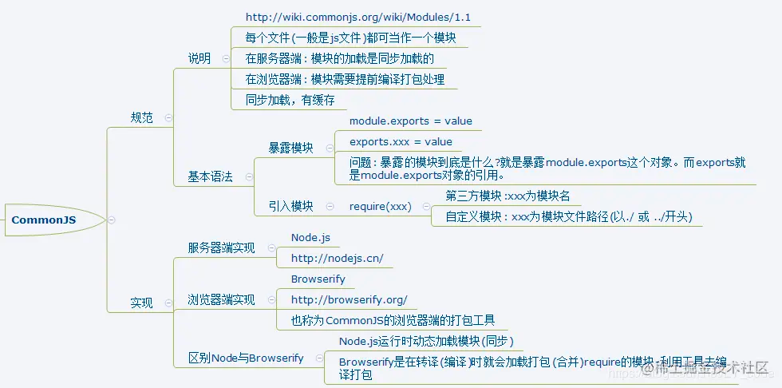
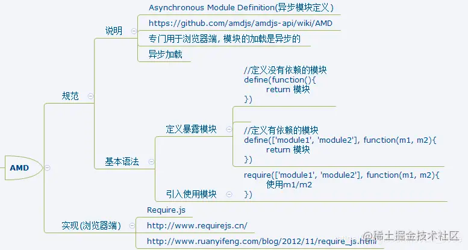
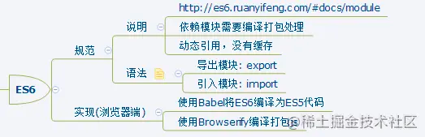

# 现代模块化方案

## CommonJS

CommonJS 是服务器端模块的规范，Node.js  就是采用了这个规范。但目前也可用于浏览器端，需要使用 Browserify 进行提前编译打包。

CommonJS 模块化的引入方式使用require ； 暴露的方式使用module.exports或exports

CommonJS 的一个模块，就是一个脚本文件。require命令第一次加载该脚本，就会执行整个脚本，然后在内存生成一个对象。
```js
const module = {
  id: '...',
  exports: {
      // ...code
  },
  loaded: true,
  // code...
}
```
说明：
上面代码就是 Node 内部加载模块后生成的一个对象。

该对象的id属性是模块名，exports属性是模块输出的各个接口，loaded属性是一个布尔值，表示该模块的脚本是否执行完毕。其他还有很多属性，这里都省略了。

所以，
**以后需要用到这个模块的时候，就会到exports属性上面取值**。即使再次执行require命令，也不会再次执行该模块，而是到缓存之中取值。也就是说，**CommonJS 模块无论加载多少次，都只会在第一次加载时运行一次，以后再加载，就返回第一次运行的结果，除非手动清除系统缓存**。



### 再谈输出
CommonJS 模块输出的是**值的拷贝**，也就是说，一旦输出一个值，模块内部的变化就影响不到这个值（这同时也佐证了上面的结论，CommonJS 模块的加载多次，都只会使用第一次运行结果的缓存。）
```js
// lib.js
var counter = 3;
function incCounter() {
  counter++;
}
module.exports = {
  counter: counter,
  incCounter: incCounter,
};
```

```js
// main.js
var mod = require('./lib');

console.log(mod.counter);  // 3
mod.incCounter();
// mod.counter++ 则是直接对缓存对象中的变量直接修改，原模块中的counter并没有改变
console.log(mod.counter); // 3
```

+ 上面代码说明，lib.js模块加载以后，它的内部变化就影响不到输出的mod.counter了。
+ 这是因为mod.counter是一个原始类型的值，会被缓存。实际上模块内的counter变量已经被修改。 除非写成一个函数来获取其中的值，才能得到内部变动后的值。

```js
// lib.js 改造
var counter = 3;
function incCounter() {
  counter++;
}
module.exports = {
    // 通过函数来获取模块中及时更新的值
  get counter() {
    return counter
  },
  incCounter: incCounter,
};
```

当然，上述例子也可以直接用ES6 模块化来解决。如下：
```js
// lib.js
export let counter = 3;
export function incCounter() {
  counter++;
}

// main.js
import { counter, incCounter } from './lib';
console.log(counter); // 3
incCounter();
console.log(counter); // 4
```
由此可以看出，ES6 模块是动态引用，并且不会缓存值，模块里面的变量绑定其所在的模块。

最后注意：
exports指向的内存地址和module.exports指向的内存地址是一样的.
就是说exports和module.exports指向同一个对象。

```js
var module = {
  id: 'xxxx', // 我总得知道怎么去找到他吧
  exports: {}, // exports 就是个空对象
}

var exports = module.exports = {};  //exports是对module.exports的引用
```

```js
function foo() {
  console.log('foo');
}

function bar() {
  console.log('bar');
}
// 可以这样导出
module.exports = {
    foo: foo,
    bar: bar
}
// 也可以这样导出
exports.foo = foo;
exports.bar = bar;

// 错误
// 因为这样做仅仅改变了exports的引用，而不改变module.exports。
exports = {
    foo: foo,
    bar: bar
}
```

## AMD
CommonJS规范加载模块是同步的，也就是说，只有加载完成，才能执行后面的操作。

由于Node.js主要用于服务器编程，模块文件一般都已经存在于本地硬盘，所以加载起来比较快，所以同步加载没有问题。

但是如果是浏览器端，同步加载很容易阻塞，这时候AMD规范就出来了。AMD规范则是非同步加载模块，允许指定回调函数。故浏览器端一般会使用AMD规范。
AMD 是 RequireJS 在推广过程中对模块定义的规范化产出。



### 简要说明RequireJS的使用：

1. 下载require.js, 并引入，将require.js导入项目: js/libs/require.js

```
// 创建项目结构
|-libs
    |-require.js
|-modules
    |-alerter.js
    |-dataService.js
|-main.js
|-index.html
```

2. 定义require.js的模块代码
```js
// dataService.js (定义一个无依赖的模块)
define(function () {
    let msg = 'hello world lyuya';
    function dataServer() {
        return msg.toUpperCase();
    }
    //暴露这个模块
    return dataServer;
});
```

3. 定义一个有依赖的模块：define(['模块1', '模块2', '模块3'], function (m1, m2，m3) {}); 注意前后一一对应
```js
// alerter.js
// 一定要注意一一对应，前面有，后面一定要有，别忘记后面的传参
define(['dataServer'],function (dataServer) {
    let msg = dataServer();
    function alerter() {
        alert(msg);
    }
    return alerter;
});
```

4. 应用主(入口)：main.js (主模块)
```js
// 配置模块的路径
requirejs.config({
    baseUrl:'./',  //配置所有引入模块的公共路径（基本路径）
    //模块标识名称与模块路径的映射
    paths : {
        // 模块名称（一定要与引入的模块名称一一对应）: 模块的路径
        dataServer: 'modular/dataServer',
        //一定不能写文件的后缀名，它会自动补全
        alerter: 'modular/alerter',
        //库/框架自己实现模块化的功能，定义了暴露模块的名称
        jquery: 'libs/jquery-1.10.1'
    }
})

//主模块引入依赖
require(['alerter','jquery'],function (alerter, jquery) {
    alerter()
    jquery('body').css('background','pink')
})
```

5. 在页面index.html中使用模块
```html
<!--src引入requirejs模块去用这个模块解析主模块-->

<script data-main="./main" src="./libs/require.js"></script>
```

## ES6模块化
ES6模块化的出现，给前端更大的方便。旨在成为浏览器和服务器通用的模块解决方案，但还是主要专门针对浏览器端。其模块功能主要由两个命令构成：export和import。现在很多项目都在使用ES6模块化规范。

ES6 模块的运行机制与 CommonJS 不一样。JS 引擎对脚本静态分析的时候，遇到模块加载命令import，就会生成一个只读引用。等到脚本真正执行时，再根据这个只读引用，到被加载的那个模块里面去取值



### 基本使用

1. 分别暴露：后面需要完整的定义（变量或函数定义）
```js
// module1.js
export function foo() {
    console.log('module1 foo()');
}
export function bar() {
    console.log('module1 bar()');
}
export const DATA_ARR = [1, 3, 5, 1]
```
2. 统一暴露 暴露的是一个对象，要暴露的数据添加为对象的属性/方法
```js
// module2.js
let data = 'module2 data'
 
 function fun1() {
   console.log('module2 fun1() ' + data);
 }
 
 function fun2() {
   console.log('module2 fun2() ' + data);
 }

export {
    data,
    fun1,
    fun2
}
```

3. + 默认暴露：只能暴露一个内容。
   + 默认暴露的本质：定义了default变量，将后面的值赋值给default变量，暴露出去
    
```js
// module3.js
export default {
    name: 'kevin',
    setName(name) {
        this.name = name
    }
}
```

4. 引用使用：
```js
import { foo, bar, DATA_ARR } from './module1.js'
import { fun1, fun2, data } from './module2.js'
import Person from './module3.js'
```

**注意点**：
1. 由于 ES6 输入的模块变量，只是一个“符号连接”，所以这个变量是只读的，对它进行重新赋值会报错。
```js
// lib.js
export let obj = {};

// main.js
import { obj } from './lib';

obj.prop = 123; // OK
obj = {}; // TypeError
```
+ 上面代码中，main.js从lib.js输入变量obj，可以对obj添加属性，但是重新赋值就会报错。
+ 因为变量obj指向的地址是只读的，不能重新赋值，这就好比main.js创造了一个名为obj的const变量。

2. export通过接口，输出的是同一个值。不同的脚本加载这个接口，得到的都是同样的实例。
```js
// mod.js
function C() {
    this.sum = 0;
    this.add = function () {
    this.sum += 1;
};
    this.show = function () {
        console.log(this.sum);
    };
}

export let c = new C();
```

```js
// x.js
import {c} from './mod';
c.add();

// y.js
import {c} from './mod';
c.show();

// main.js
import './x';
import './y';
```
现在执行main.js，输出的是1。

3. import命令具有提升效果，会提升到整个模块的头部，首先执行。
```js
foo();

import { foo } from 'my_module';
```
上面的代码不会报错，因为import的执行早于foo的调用。这种行为的本质是，import命令是编译阶段执行的，在代码运行之前。

4. 由于import是静态执行，所以不能使用表达式和变量，这些只有在运行时才能得到结果的语法结构。
```
// 报错
import { 'f' + 'oo' } from 'my_module';

// 报错
let module = 'my_module';
import { foo } from module;

// 报错
if (x === 1) {
  import { foo } from 'module1';
} else {
  import { foo } from 'module2';
}
```
上面三种写法都会报错，因为它们用到了表达式、变量和if结构。在静态分析阶段，这些语法都是没法得到值的。

5. import语句会执行所加载的模块，因此可以有下面的写法。

`import 'lodash';` 仅仅执行lodash模块，但是不输入任何值。

如果多次重复执行同一句import语句，那么只会执行一次，而不会执行多次。
```js
import 'lodash';
import 'lodash';
```

```js
import { foo } from 'my_module';
import { bar } from 'my_module';

// 等同于
import { foo, bar } from 'my_module';
```
上面代码中，虽然foo和bar在两个语句中加载，但是它们对应的是同一个my_module模块。
也就是说，import语句是 Singleton 模式。

### import()

前面介绍过，import命令会被 JavaScript 引擎静态分析，先于模块内的其他语句执行。import和export命令只能在模块的顶层，不能在代码块之中（比如，在if代码块之中，或在函数之中）。

+ 这样的设计，固然有利于编译器提高效率，但也导致无法在运行时加载模块。在语法上，条件加载就不可能实现。
+ 如果import命令要取代 Node 的require方法，这就形成了一个障碍。因为require是运行时加载模块，import命令无法取代require的动态加载功能。
```js
const path = './' + fileName;
const myModual = require(path);
```
上面的语句就是动态加载，require到底加载哪一个模块，只有运行时才知道。import命令做不到这一点。


所以，ES2020提案 引入import()函数，支持动态加载模块。 import()返回一个 Promise 对象。下面是一个例子。

```js
const main = document.querySelector('main');

import(`./section-modules/${someVariable}.js`)
.then(module => {
module.loadPageInto(main);
})
.catch(err => {
main.textContent = err.message;
});
```
+ import()函数可以用在任何地方，不仅仅是模块，非模块的脚本也可以使用。它是运行时执行，也就是说，什么时候运行到这一句，就会加载指定的模块。
+ 另外，import()函数与所加载的模块没有静态连接关系，这点也是与import语句不相同。import()类似于 Node 的require方法，区别主要是前者是异步加载，后者是同步加载。


适用场合:

1. 按需加载。

import()可以在需要的时候，再加载某个模块。

```js
button.addEventListener('click', event => {
   import('./dialogBox.js')
           .then(dialogBox => {
              dialogBox.open();
           })
           .catch(error => {
              /* Error handling */
           })
})
```
+ 上面代码中，import()方法放在click事件的监听函数之中，只有用户点击了按钮，才会加载这个模块。
+ 同时，Vue中切换路由，按需加载对应的组件时，也会用到这个。
  
eg：
```js
new Vue({
  // ...
  components: {
    'my-component': () => import('./my-async-component')
  }
})
```

2. 条件加载

import()可以放在if代码块，根据不同的情况，加载不同的模块。

```js
if (condition) {
    import('moduleA').then(
        // ...code
    );
} else {
    import('moduleB').then(
        // ...code
    );
}
```
上面代码中，如果满足条件，就加载模块 A，否则加载模块 B。

3. 动态的模块路径：import()允许模块路径动态生成。
```js
import(f()).then(
   // ...code
)
```
上面代码中，根据函数f的返回结果，加载不同的模块。

总结：
1. ES6 模块是动态引用，如果使用import从一个模块加载变量（即import foo from 'foo'），那些变量不会被缓存，而是成为一个指向被加载模块的引用，需要开发者自己保证，真正取值的时候能够取到值。
2. 因此，ES6模块是动态引用，不存在缓存值的问题，而且模块里面的变量，绑定其所在的模块。
3. 而CommonJS模块的重要特性是**加载时执行**，即脚本代码在require的时候，就会全部执行。
4. CommonJS的做法是，一旦出现某个模块被"循环加载"，就只输出已经执行的部分(从缓存中取值)，还未执行的部分不会输出。
5. CommonJS输出的接口是值的拷贝，ES6 模块输出的接口是指向被加载模块的引用。
6. CommonJS运行时加载脚本，ES6 模块在编译时静态分析脚本。
7. CommonJS require可以使用动态引用，条件引用。ES6 模块的import命令不可以做这些。需要使用import()
